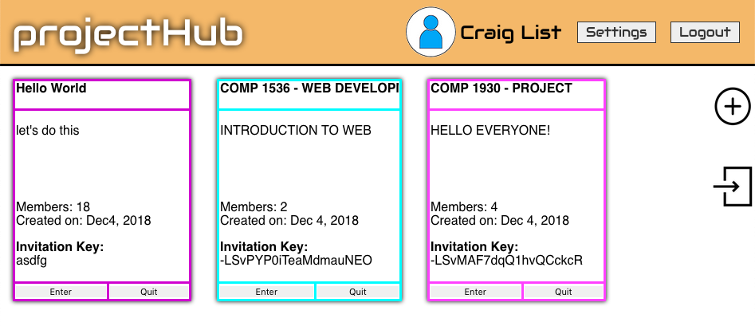
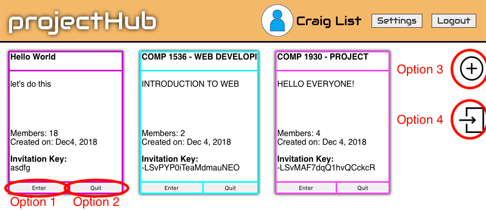
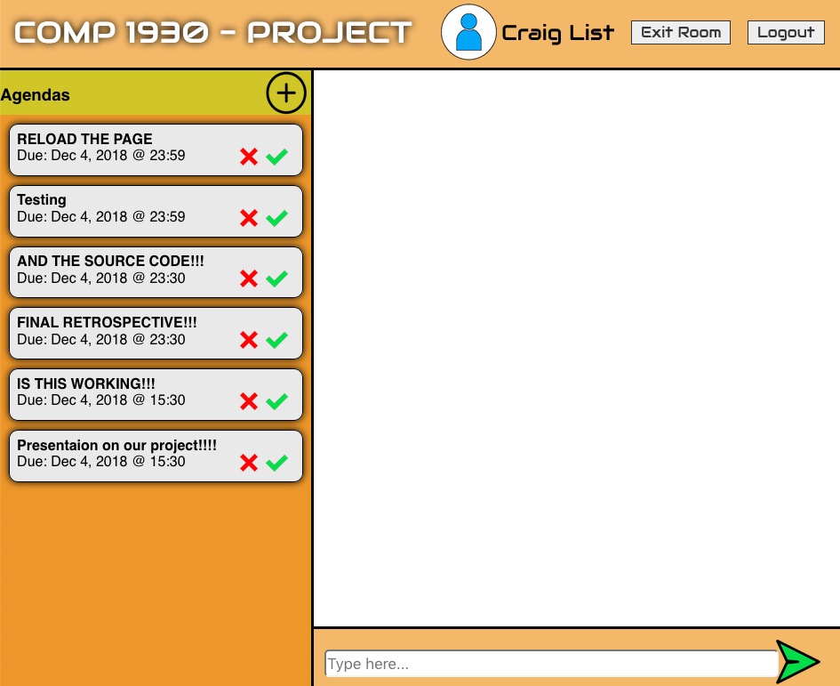
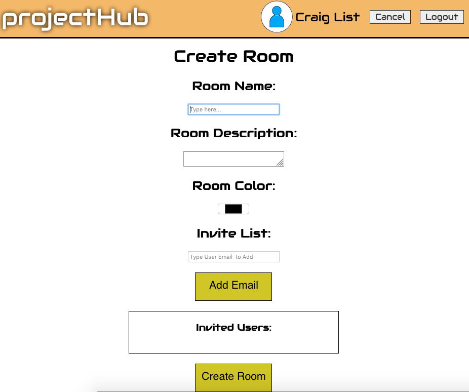
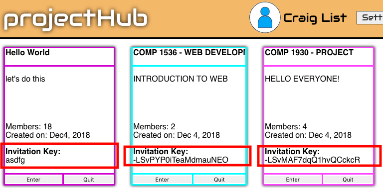

# projectHub

projectHub is a web app that is easy to set up group chat and track group tasks. You can create agendas as you discuss assignments of tasks so that everyone knows what they are supposed to do. It also aims to minimize user frustration in the process.

## Getting Started

Click the [link](https://www.accountchooser.com/redirect.html#jcolussi2.students.bcit.ca) to use the app.

## Walk-Through

At the landing page, the user can log in directly if already has an account. Otherwise, the user needs to provide a username and sign up with his/her email. Below is the screenshot of the landing page.

Once the user logged in, he/she can see the groups that he/she is in on the main page. 

The user is provided with four options on the main page.

The user can choose to enter a room, which will direct the user to the chat room,

and exit a room, which will delete the room from the main page. Besides from entering and exiting a room, the user can also choose to create a room, which will direct the user to the page for creating a room, 

and join a room, which will prompt to ask for an invitation key from the user. The Invitation key to join a room are located on the main page in the group tables. It is shared for friends to join the room.

When the user logs out on any page, he/she will be redirected to the landing page. Each page listens for the user's authentication status. If the user is logged out somehow, he/she will be redirected to the landing page.

**Setting button currently does nothing.

## Built With
- Atom
- Visual Studio Code
- Notepad++
- Chrome/Firefox

## Authors
- Paolo Del Rio - log in page (css, js, html)
- Damon (Demiao) Ren - main page and agenda (css, js, html)
- Joel Colussi - chat room page (css, js, html)

## Acknowledgments
- Thanks Carly Orr and Vidhi Shah for guiding us through the process and teaching us to think like a user
- Thanks Alistair Calder (Lab instructor for COMP 1536) for giving us a free server space to host our web app.
- Thanks GitHub for providing a free collaborating/version control platform

## License
Copy Right Reserved. Email For More Info.
